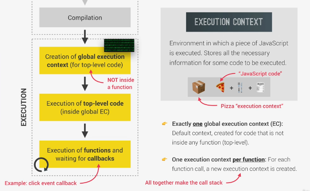
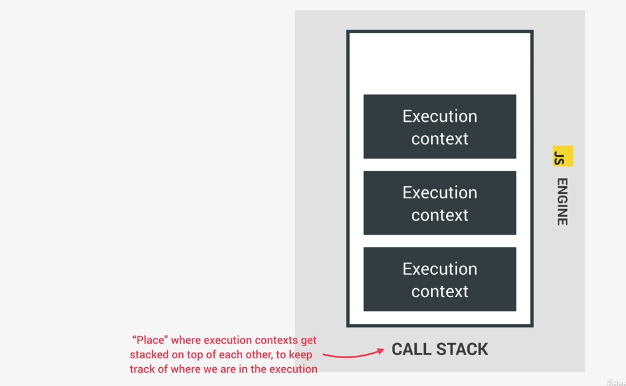

# Execution Context 
* Environment in which a piece of Javascript is executed.
* Stores all the necessary information for some code to be executed.
* Exactly one global execution Context (EC) i.e, default context, created for code that is not inside any function (top level)
* For each function call, a new execution context is created.

> After the compilation, In the execution step -


## What's inside the Execution Context?
```
1. Variable Environment ( let, const, var declarations, functions, arguements objext)
2. Scope chain ( variable scoping thing, block scoped etc.)
3. this keyword.
```

> Note: arguments object and this keyword are not present in execution context of arrow functions.
---
# The call Stack

* It's a place where execution context s get stacked on top of each other to keep track of where we are in the programs execution.
* Execution context which is on top of stack is currently running.
